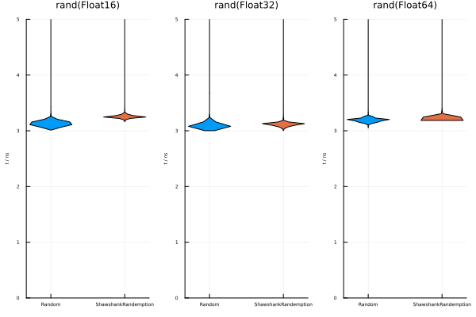
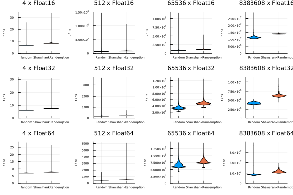
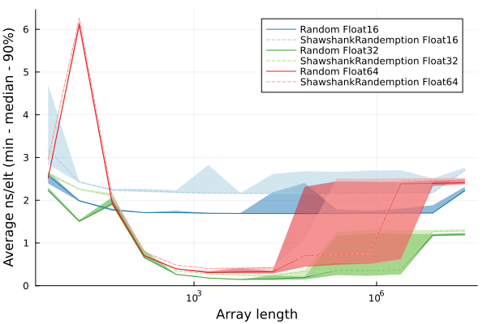

Simple fork of the Random stdlib that changes the definition of `rand()` for floating point numbers such that:

* For `Float16`, `Float32`, and `Float64` it returns values in [0, 1) as though a random variable were drawn from a theoretically ideal uniform distribution and then rounded down the previous multiple of 2^-64 (or to the previous floating point number).

The current floating implementation currently rounds down to the previous multiple of `eps(T)/2` for all three types.

Concretely, this prototype means that every `Float16` value `x ∈ [0,1)` is a possible output, chosen with probability `eps(x)`. For `Float32`, the possible outputs are multiples of 2^-64 in `[0, 2^-49)`, chosen with probability 2^-64, and every `x ∈ [2^-49, 1)`, chosen with probability `eps(x)`.  And `Float64` returns multiples of 2^-64 up to a value of 2^-11.  As a table:

  | Implementation | Possible Outputs | P(rand() = x) |
  | ---- | ---- | ---- |
  | Random.rand(::T) | multiples of `eps(T(0.5))` in `[0, 1)`     |  `eps(T(0.5))`    |
  | SR.rand(::Float16)     | all `x ∈ [0,1)`     | `eps(x)`    |
  | SR.rand(::Float32)     | multiples of 2^-64 in `[0, 2^-49)`   all `x ∈ [2^-49,1)`     | `2^-64`   `eps(x)`    |
  | SR.rand(::Float64)     | multiples of 2^-64 in `[0, 2^-11)`   all `x ∈ [2^-11,1)`     | `2^-64`   `eps(x)`    |

Performance is about the same for scalars. For the SIMD `rand!`, performance is slightly worse on a M1, but no worse than 2x (most affected is `rand!(::Vector{Float32})`):

And on an Intel system with AVX-512 scalar performance is similar but array performance is nearly equivalent:

