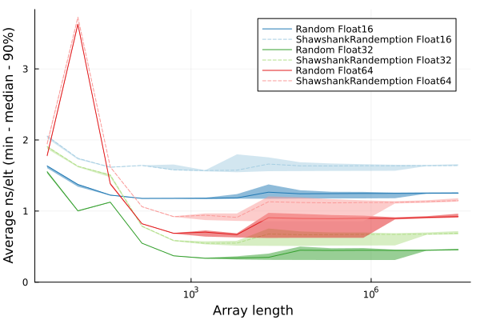

Simple fork of the Random stdlib that changes the definition of `rand()` for floating point numbers such that:

* For `Float16` it returns values in [0, 1) as though a random variable were drawn from a theoretically ideal uniform distribution and then rounded down to the previous floating point number.
* For `Float32`, and `Float64` it return values in [0, 1) as though a random variable were drawn from a theoretically ideal uniform distribution and then rounded down the previous multiple of 2^-64 (or to the previous floating point number).

The current floating implementation currently rounds down to the previous multiple of `eps(T)/2` for all three types.

Performance is slightly worse (particularly for Float64), but less than 2x:

